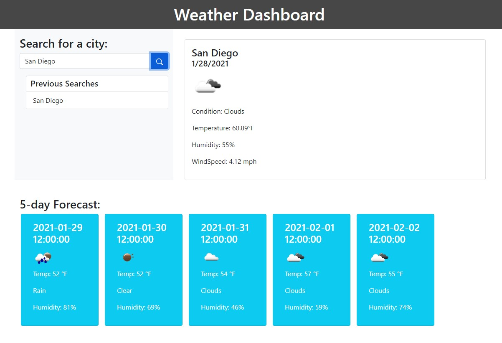

## Weather Forecast App

## Description
Weather forecast app is a simple web app that displays the current and upcoming weather for any given city that is entered.

## Installation
Clone this repository and open html (js inline) and css files in code editor. View website at https://mpkahn.github.io/homework06/. Images in assets folder.

## Usage
Open https://mpkahn.github.io/homework06/ And you will see a mostly blank page with a text field asking you to input a city. 

Type your city and click on the blue search bar.

You will then see the current day's weather information on the right hand side (including date, condition (with image), temperature, humidity, and wind speed)

The upcoming 5 day's forecast down below the bottom of the page, this includes only date, condition (with image), temp, and humidity.
Lastly, a list of recent searches underneath the search bar is displayed (unfortunately these are not clickable)

## Credits
Much credit goes to bootstrap for various elements, icons, and guidance https://icons.getbootstrap.com/

OpenWeather API is what provided all weather information https://openweathermap.org/api

W3schools helped with a lot  of various javascript and CSS elements

## License
MIT License

Copyright (c) [2021] [Michael Kahn]

Permission is hereby granted, free of charge, to any person obtaining a copy of this software and associated documentation files (the "Software"), to deal in the Software without restriction, including without limitation the rights to use, copy, modify, merge, publish, distribute, sublicense, and/or sell copies of the Software, and to permit persons to whom the Software is furnished to do so, subject to the following conditions:

The above copyright notice and this permission notice shall be included in all copies or substantial portions of the Software.

THE SOFTWARE IS PROVIDED "AS IS", WITHOUT WARRANTY OF ANY KIND, EXPRESS OR IMPLIED, INCLUDING BUT NOT LIMITED TO THE WARRANTIES OF MERCHANTABILITY, FITNESS FOR A PARTICULAR PURPOSE AND NONINFRINGEMENT. IN NO EVENT SHALL THE AUTHORS OR COPYRIGHT HOLDERS BE LIABLE FOR ANY CLAIM, DAMAGES OR OTHER LIABILITY, WHETHER IN AN ACTION OF CONTRACT, TORT OR OTHERWISE, ARISING FROM, OUT OF OR IN CONNECTION WITH THE SOFTWARE OR THE USE OR OTHER DEALINGS IN THE SOFTWARE.
